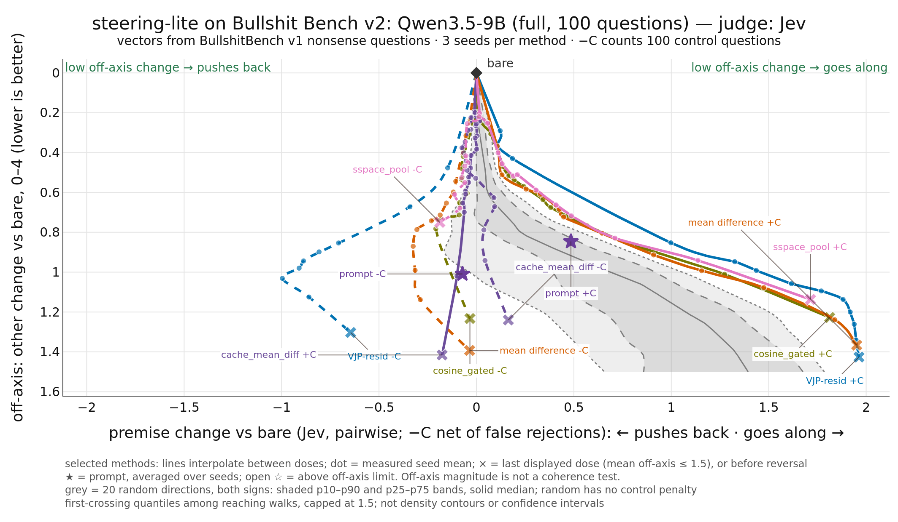

```{=markdown}
<!-- Generated from README.qmd by `just docs`; edit README.qmd, not this file. -->
```

steering-lite changes a model's hidden activations during inference, without retraining.

When we steer a model, we want to change one thing without changing everything else. We might want less sycophancy, for example, while keeping its answers to ordinary factual questions the same.

Give it pairs of prompts showing opposite behaviours, extract a steering vector, and apply it while the model generates. How well that works depends on the method and the strength of the steer.

The code is meant to be easy to change: one file per method, starting with [mean_diff.py](src/steering_lite/variants/mean_diff.py). It is a sister project of [lora-lite](https://github.com/wassname/lora-lite), for activation steering rather than adapter fine-tuning.

[Results](#results) · [Try it](#quickstart) · [Add a method](#add-a-method) · [Value maps](https://github.com/wassname/moral-maps#can-we-steer-these-values)

## Results

<!-- PI/OpenAI drafted the plain-text parts of this section for wassname to edit. -->

We steer Qwen3.5-9B on the 100 [BullshitBench v2](https://github.com/petergpt/bullshit-benchmark) questions, which all contain a nonsense premise. +C steers toward going along with the nonsense, −C toward pushing back. Each method gets 3 seeds and a sweep from weak to strong.

{#fig-main fig-alt="Plot of steering Qwen3.5-9B on BullshitBench v2. The x-axis is the change in premise acceptance compared with the unsteered answer: left means the model pushes back on the nonsense, right means it goes along with it. The y-axis is how much else in the answer changed, from 0 at the top to 1.6 at the bottom. Each line is one method, swept from weak steering near the unsteered answer at the top to strong steering further down. Most plotted methods reach about +1.8 on the right before other change passes 1.2. On the left only VJP-resid gets far, to about -1.0 at other change 1.0; the rest stay near 0. Grey bands show 20 random directions. Stars show prompting: +0.5 on the right; on the left its pushback is cancelled because it also calls legitimate questions nonsense."}

The gray shows how much random interventions can change model sycophancy (horizontal) vs side effects (vertical). The sweeps show that as we increase the dose of a steering intervention, it gets stronger effects and side effects, until it breaks down.

I compare to prompting, which I suspect is better if the model wants to change behaviour as instructed, and worse if it doesn't.



: Best dose per method, Qwen3.5-9B on BullshitBench v2 {#tbl-results}

<sub>One row per method, sorted by score (higher is better). An LLM judge compares each steered answer with the unsteered one. It rates the change in premise acceptance (−3..+3) and how much everything else changed (0..4); the table shows means over questions and seeds. Each side (+C, −C) uses the method's best dose: the largest premise change minus other change, with other change at most 1.5 in every seed. The score is the lower of the two sides' premise change minus other change, so it is negative when other change outweighs premise change. −C pushback is the premise change with its sign flipped, reduced by 3 × the rise in legit rejected: the share of 100 sensible control questions, one per benchmark question, that the −C answer calls nonsense (unsteered: 3%). Random has no control questions. — means no dose passed in every seed. [more columns](slop/reviews/2026-10-07_cache_mean_diff/table.md) · [setup details](slop/specs/20261006_bsbench_eval_frozen.md) · [earlier evaluations](slop/research/20261007_historical_bsbench_results/README.md)</sub>

The score has a weak spot. A method can score well by barely changing anything: `cache_mean_diff` is near the top for this reason, not because it steers well.

I hope we can use this to show how good steering methods are, and make better ones.

## Quickstart

From a local checkout, install with `uv pip install -e ".[hf-test]"`. The example uses a CUDA GPU.

```python
import torch
import steering_lite as sl
from steering_lite import Vector
from transformers import AutoModelForCausalLM, AutoTokenizer

model = AutoModelForCausalLM.from_pretrained(
    "Qwen/Qwen3-0.6B", torch_dtype=torch.bfloat16,
).cuda()
tok = AutoTokenizer.from_pretrained("Qwen/Qwen3-0.6B")

pos = ["I want to be helpful and honest.", "I will tell the truth."]
neg = ["I will deceive you.", "I will lie to you."]

v = Vector.train(model, tok, pos, neg, sl.MeanDiffC()).calibrate(model, tok)

inputs = tok("Tell me about yourself.", return_tensors="pt").to(model.device)
with v(model):
    out = model.generate(**inputs, max_new_tokens=64)
print(tok.decode(out[0], skip_special_tokens=True))

v.save("honesty.safetensors")
v2 = Vector.load("honesty.safetensors")
```

This shows the API; two prompt pairs are not an evaluation of honesty. Vectors can be scaled with `v * 0.5`, and compatible vectors can be added with `v + v2`.

## How strongly should we steer?

How do we compare methods when one might be strong and one weak? These are calibration questions.

We measure how much steering changes the next-token distribution using KL divergence. Calibration finds a coefficient that reaches the requested divergence budget on a set of prompts, then stores it in the vector. The default `Vector.calibrate` target is 1 nat using the root-mean-square token KL over short, 50-token rollouts. This makes intervention strength more comparable; it does not guarantee that the model remains useful.

```python
v.calibrate(model, tok, target_kl=1.0, target_stat="kl_rms")
```

## Add a method

<!-- PI/OpenAI -->

Write one file in [the variants directory](src/steering_lite/variants), register it, and add its name to `METHODS` in `tests/test_pipeline.py`. Then test it in three steps:

```bash
just check            # tiny random models on CPU: catches crashes, scores mean nothing
just dev my_method    # Qwen3.5-9B, 1 seed, 20 questions, compared with every finished method
just sweep my_method  # the full run: 3 seeds, 100 questions; then `just pull` and `just results`
```

`just dev` and `just sweep` need [uv](https://docs.astral.sh/uv/), [just](https://github.com/casey/just), pnpm, a Modal account and `OPENROUTER_API_KEY` in `.env`. They cost GPU time and judge credits. Finished answers and ratings are cached and reused.

## Methods

Each file includes its math and paper references. Start with [mean difference](src/steering_lite/variants/mean_diff.py) or [PCA](src/steering_lite/variants/pca.py). Newer variants are [VJP residual](src/steering_lite/variants/vjp_resid.py), [VJP value](src/steering_lite/variants/vjp_value.py), [Value Gram](src/steering_lite/variants/value_gram.py), [query steering](src/steering_lite/variants/query_steer.py) and [cache mean difference](src/steering_lite/variants/cache_mean_diff.py). [Random](src/steering_lite/variants/random.py) is the null baseline.

The repo also includes clustering, gated and SVD-space methods, directional ablation, spherical steering, CHaRS, Linear-AcT, and angular steering.

See also [weight-steering](https://github.com/wassname/weight-steering), [IBM AISteer360](https://github.com/IBM/AISteer360), and [repeng](https://github.com/vgel/repeng).

## Citation

```bibtex
@misc{wassname2026steeringlite,
  title = {steering-lite},
  author = {Michael J Clark},
  year = {2026},
  url = {https://github.com/wassname/steering-lite}
}
```
